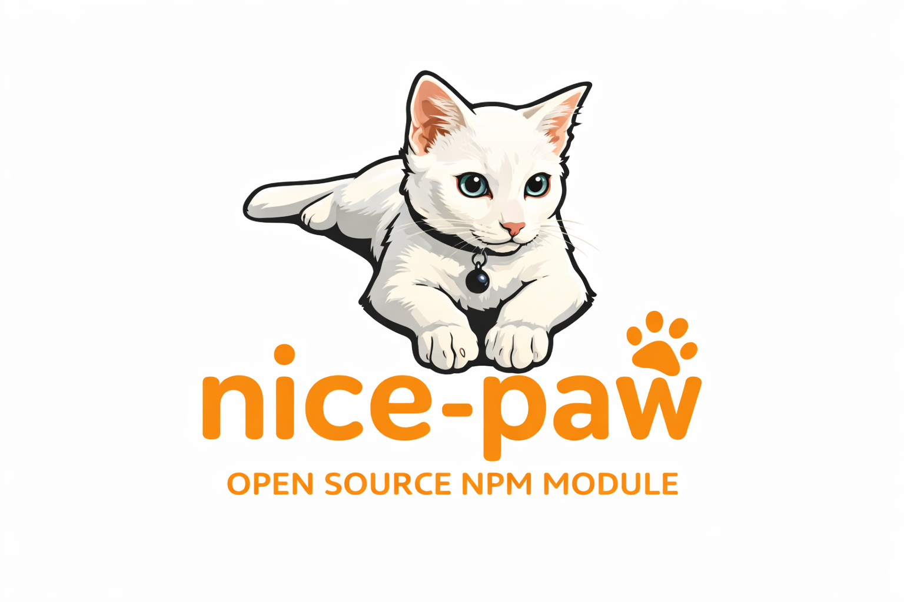

# nice-paw

A TypeScript library example.

## Installation

```bash
npm install nice-paw
```

## Usage

```typescript
import { greet } from 'nice-paw';

console.log(greet('World')); // Hello, World!
```

## Development

### Prerequisites
- Node.js 16+
- npm or yarn

### Setup
```bash
npm install
```

### Build
```bash
npm run build
```

### Watch Mode
```bash
npm run dev
```

### Testing
```bash
# Run tests once
npm test

# Watch mode
npm run test:watch

# With coverage
npm run test:coverage
```

### Publishing
```bash
npm run build
npm publish
```

## License

ISC